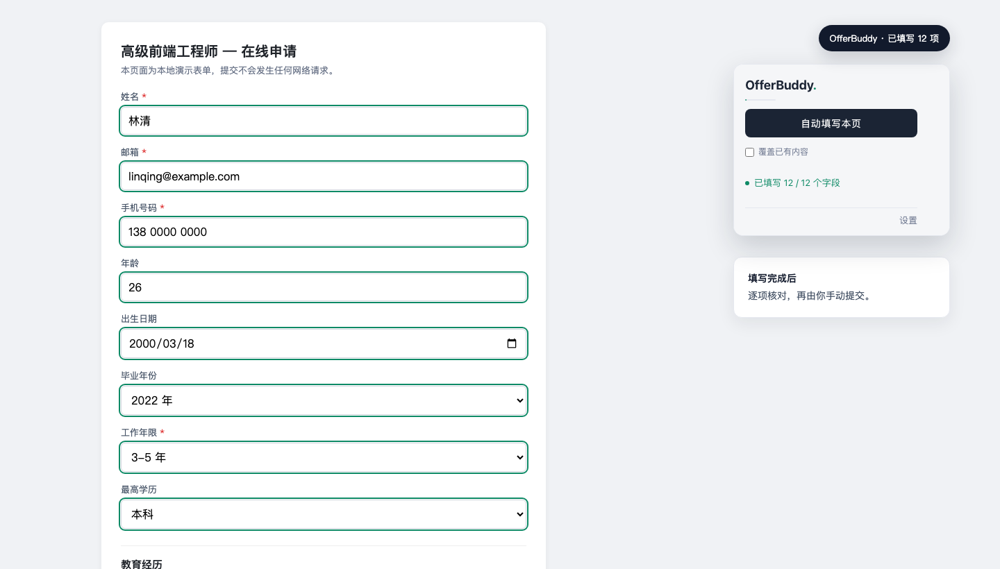
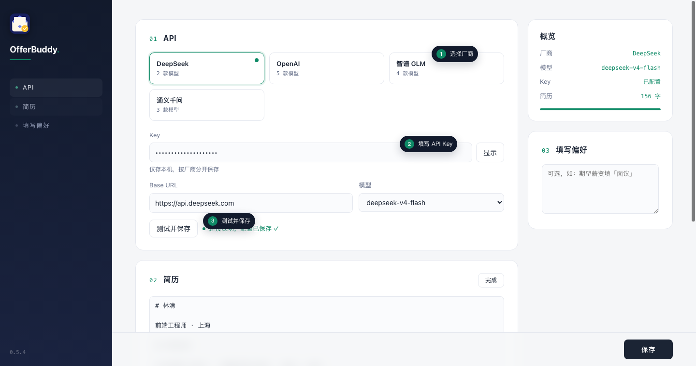
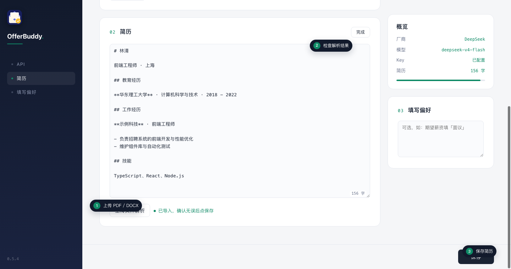

<div align="center">
  
  <h1>OfferBuddy</h1>
  <p>简历写一次，表单少填很多次。</p>
  <p>
    <a href="#快速开始">快速开始</a> ·
    <a href="#支持范围">支持范围</a> ·
    <a href="#数据与权限">数据与权限</a> ·
    <a href="#开发">开发</a>
  </p>
  <p>
    
    
    
  </p>
</div>



准备材料只做一次，姓名、学校和项目经历却要在每家招聘网站重新敲一遍。

OfferBuddy 把这部分杂活接过去。你照常打开岗位页面，点一下扩展，它会读取表单、对照简历并逐项填写。整个过程就在眼前，填错了可以改，原本有内容的字段也不会被随便覆盖。

> OfferBuddy 只负责填写，不会替你提交。最后一次确认永远留给你。

## 少做一点复制粘贴

你已经在简历里认真写过项目背景和工作内容，没必要到了投递页面再写一遍。OfferBuddy 会尽量沿用简历原文，把原话放到合适的字段里。

PDF、DOCX、Markdown 和 TXT 都可以直接导入。碰到「添加教育经历」这类按钮，它会按简历里的段数补齐条目。页面上已经填过的内容默认跳过，最后仍然空着的必填项会单独标出来。

模型也由你自己选。DeepSeek、OpenAI、Kimi、GLM、通义千问都能直接配置，也可以接入其他 OpenAI 兼容接口。

## 快速开始

### 1. 装上扩展

```bash
git clone git@github.com:xie-xyh/OfferBuddy.git
```

打开 `chrome://extensions`，开启右上角的「开发者模式」，点击「加载已解压的扩展程序」，选择刚刚克隆的 `OfferBuddy` 目录。

代码更新后，需要回到这个页面点击一次「重新加载」。

### 2. 接上你常用的模型

打开扩展设置，选择厂商并填写 API Key。点击「测试并保存」，看到绿色提示后即可继续。



Key 只保存在 `chrome.storage.local`。不同厂商的 Key 分开存储，切换厂商时不会互相覆盖。

### 3. 把简历放进来

进入「简历」区域，点击编辑，然后上传 PDF、DOCX、Markdown 或 TXT 文件。OfferBuddy 会先在本地提取文字，再调用你配置的模型整理为 Markdown。



解析完成后先检查内容，再点击保存。你也可以直接粘贴已经整理好的 Markdown。

### 4. 打开岗位页面，开始填写

打开投递页面，点击扩展图标，再点「自动填写本页」。OfferBuddy 会滚动到正在处理的字段，填好的内容会出现绿色描边。

你只需要在最后核对一遍。如果表单分成多页，进入下一页后再点一次即可。

## 支持范围

| 能力 | 当前支持 |
| --- | --- |
| 浏览器 | Chrome，Manifest V3 |
| 简历文件 | PDF、DOCX、Markdown、TXT |
| 表单控件 | input、textarea、select、radio、checkbox、contenteditable |
| 前端框架 | 原生页面，以及常见的 React、Vue 受控输入框 |
| 模型接口 | 内置厂商和 OpenAI 兼容接口 |
| 多段经历 | 教育、工作、实习、项目等可重复条目 |

模型候选列表维护在 [`shared/providers.js`](shared/providers.js)。自定义接口需要提供 Base URL 和模型名。

以下情况仍需手动处理：

- 文件上传控件。浏览器不允许扩展替你选择本地附件
- 验证码、登录和提交操作
- 结构非常规且无法识别的自定义下拉框
- 需要跨页面保存状态的复杂流程

## 数据与权限

- API Key 存在浏览器本地存储中，不会写入仓库
- PDF 和 DOCX 的文字提取在本地完成
- 整理简历时，提取出的文字会发送到你配置的模型接口
- 填写表单时，简历和当前页面字段会发送到同一接口
- 扩展不会点击提交，也不会处理验证码或绕过登录

扩展使用 `storage`、`activeTab` 和 `scripting` 权限。自定义 API 地址会单独请求对应的主机权限。

## 本地演示

仓库带有一个不发送网络请求的招聘表单，可用于检查字段识别和多段经历：

```bash
python3 -m http.server 8080
```

浏览器打开 [http://localhost:8080/demo/form.html](http://localhost:8080/demo/form.html)，然后运行 OfferBuddy。

## 开发

项目不依赖构建工具，加载仓库目录即可调试。

```bash
npm test
git config core.hooksPath .githooks
```

测试使用 Node 内置的 `node:test`。任何功能改动或 bug 修复都要先更新 `tests/`，再提交代码。纯逻辑放在 `shared/`，DOM 和 `chrome.*` 调用保持在页面脚本中。

主要文件：

| 文件 | 用途 |
| --- | --- |
| `background.js` | 调用模型接口，处理长请求和重试 |
| `content.js` | 识别字段并写回页面 |
| `options.js` | API、简历和填写偏好设置 |
| `shared/` | 浏览器与 Node 测试共用的纯逻辑 |
| `tests/` | 单元测试和解析库冒烟测试 |
| `demo/form.html` | 本地演示表单 |

更完整的维护约定见 [`AGENTS.md`](AGENTS.md)。

## 后续计划

- 按站点保存字段映射
- 多份简历与岗位切换
- 求职信生成
- Firefox 支持
- Chrome Web Store 发布

## 许可证

[MIT](LICENSE) © xie-xyh
